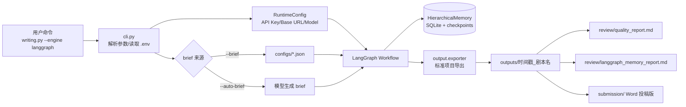
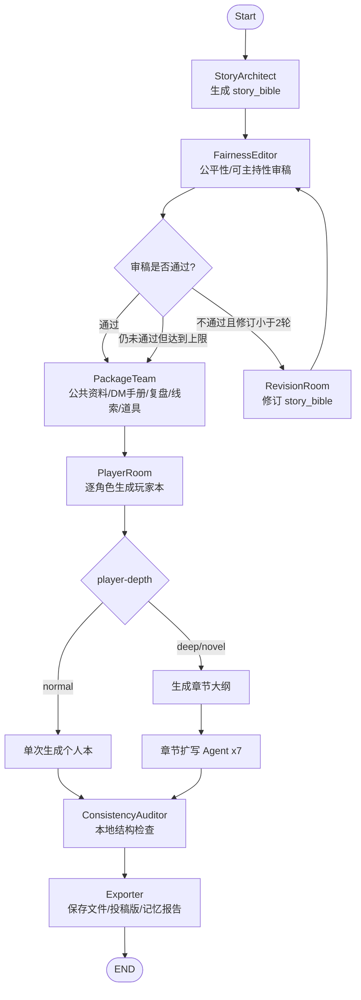
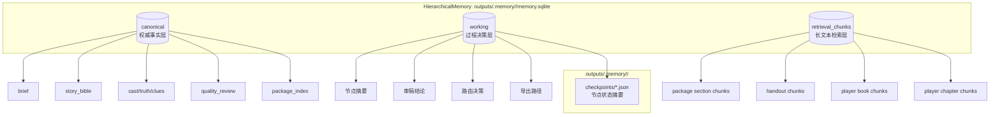
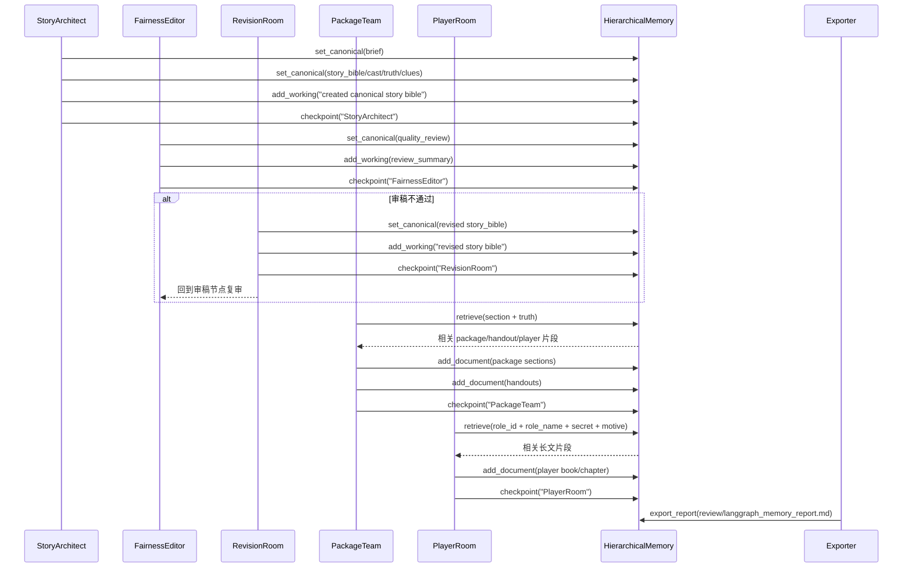
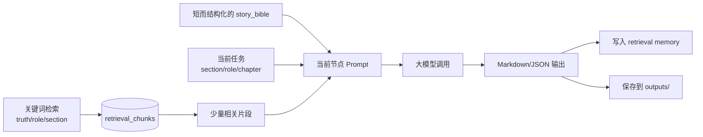
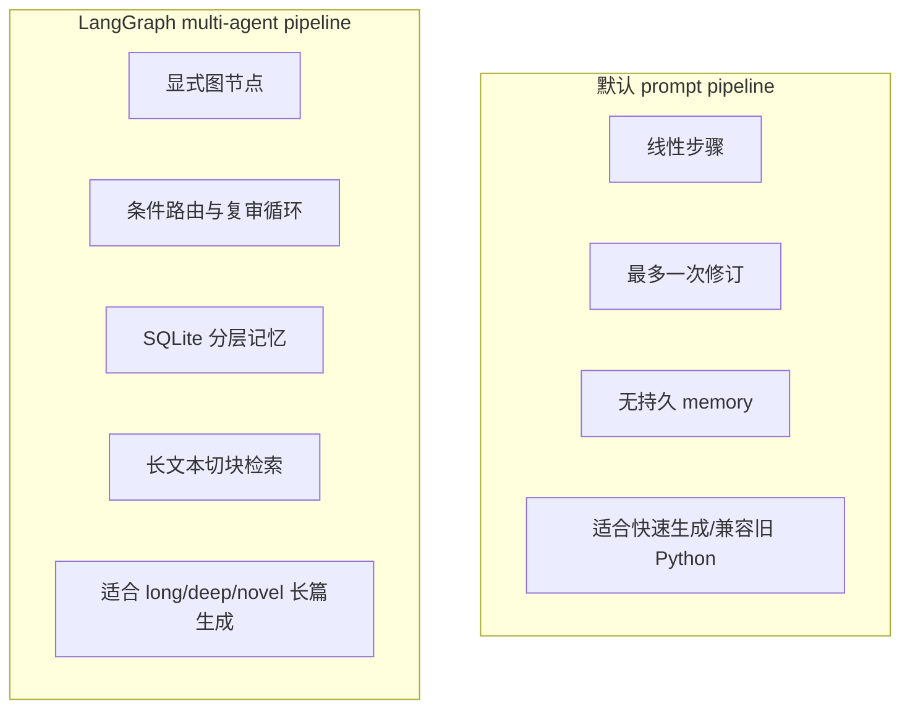

# 多 Agent 与分层记忆技术流图

本文档说明 LangGraph 生成引擎中，多 Agent 如何协作、Memory 如何分层，以及二者如何交互。

## 1. 总体架构

## 2. 多 Agent 协作图

## 3. 分层 Memory 设计

三层含义：

- `canonical`：只放权威事实，后续生成必须以它为准。
- `working`：记录节点做过什么、为什么返工、什么时候继续。
- `retrieval_chunks`：把长文本切块，后续按关键词检索回来，避免把所有正文塞进 prompt。

## 4. Agent 与 Memory 的交互

## 5. 长篇生成时的上下文控制

这个设计的关键是：`story_bible` 负责全局一致性，`retrieval memory` 负责长文本连续性。每次调用只带“当前任务需要的上下文”，而不是把所有已生成内容全部塞回模型。

## 6. 当前实现中的 Agent/Memory 对应关系

| 节点 | 主要代码 | Memory 读 | Memory 写 |
| --- | --- | --- | --- |
| StoryArchitect | `node_story_architect` | 无 | `brief`, `story_bible`, `cast`, `truth`, `clues`, checkpoint |
| FairnessEditor | `node_fairness_editor` | `bible` state | `quality_review`, checkpoint |
| RevisionRoom | `node_revision_room` | `review`, `bible` state | revised `story_bible`, checkpoint |
| Router | `route_after_review` | `review`, `revision_count` | 路由决策 working memory |
| PackageTeam | `node_package_team` | `retrieve_context()` | package sections, handouts, checkpoint |
| PlayerRoom | `node_player_room` | `retrieve_context()` | player docs/chapters, checkpoint |
| ConsistencyAuditor | `node_consistency_auditor` | state | warnings, checkpoint |
| Exporter | `node_exporter` | memory summary | `langgraph_memory_report.md` |

## 7. 与默认 prompt pipeline 的区别

