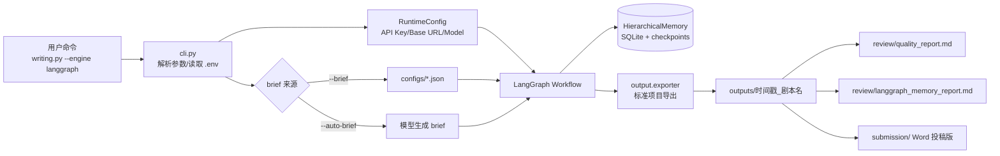
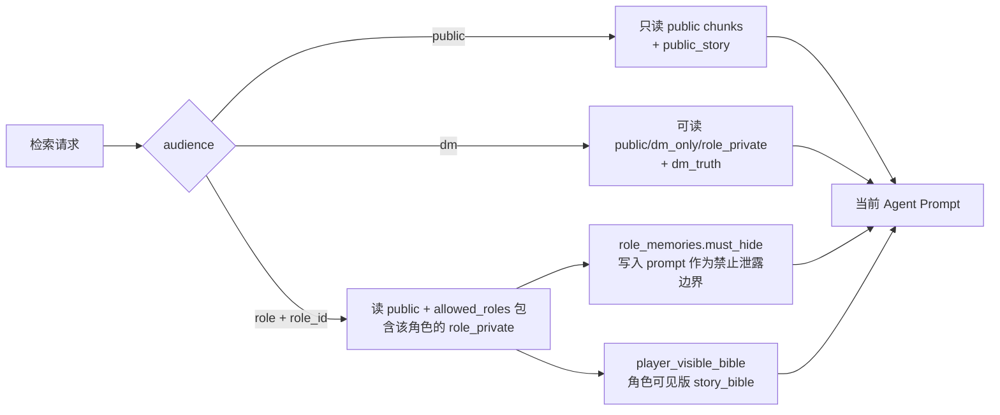
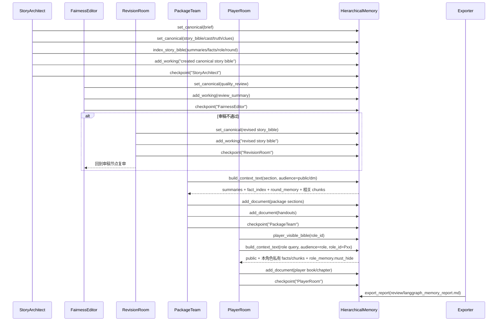
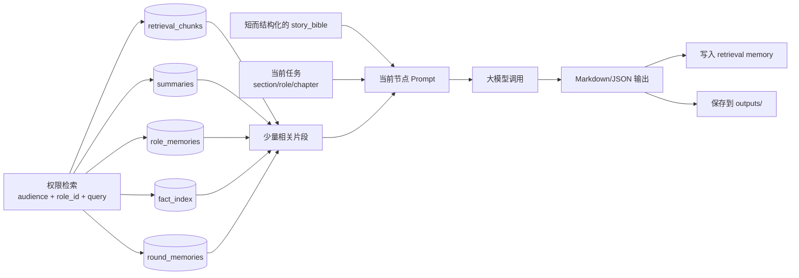
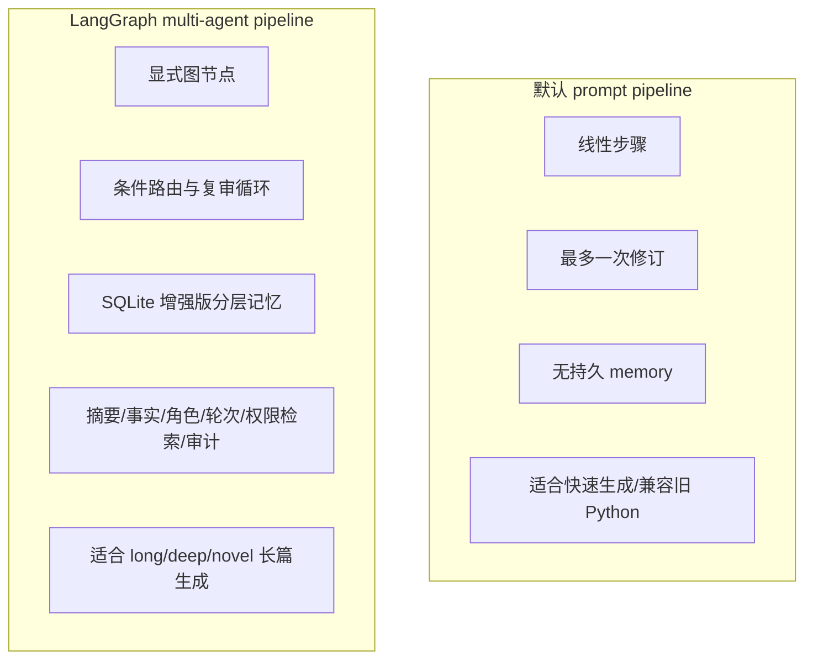

# 多 Agent 与分层记忆技术流图

本文档说明 LangGraph 生成引擎中，多 Agent 如何协作、Memory 如何分层，以及二者如何交互。

## 1. 总体架构

## 2. 多 Agent 协作图

## 3. 增强版分层 Memory 设计

```mermaid
flowchart TB
    subgraph Memory["HierarchicalMemory: outputs/.memory/<run_id>/memory.sqlite"]
        Canonical[(canonical<br/>权威事实层)]
        Working[(working<br/>过程决策层)]
        Summary[(summaries<br/>全局/公开/DM摘要)]
        RoleMem[(role_memories<br/>角色权限记忆)]
        RoundMem[(round_memories<br/>幕/轮次记忆)]
        FactIndex[(fact_index<br/>权限化事实索引)]
        Retrieval[(retrieval_chunks<br/>带权限标签的长文本检索层)]
        Events[(memory_events<br/>写入事件日志)]
        Audits[(context_audits<br/>上下文读取审计)]
    end

    subgraph Files["outputs/.memory/<run_id>/"]
        Checkpoints[checkpoints/*.json<br/>节点状态摘要]
    end

    Canonical --> C1[brief]
    Canonical --> C2[story_bible]
    Canonical --> C3[cast/truth/clues]
    Canonical --> C4[quality_review]
    Canonical --> C5[package_index]

    Working --> W1[节点摘要]
    Working --> W2[审稿结论]
    Working --> W3[路由决策]
    Working --> W4[导出路径]

    Summary --> S1[global_story]
    Summary --> S2[public_story]
    Summary --> S3[dm_truth]

    RoleMem --> RM1[public/private]
    RoleMem --> RM2[can_know]
    RoleMem --> RM3[must_hide]
    RoleMem --> RM4[relationships]

    RoundMem --> AM1[public_event]
    RoundMem --> AM2[dm_goal]
    RoundMem --> AM3[release_clues]

    FactIndex --> F1[world facts]
    FactIndex --> F2[role facts]
    FactIndex --> F3[clue facts]
    FactIndex --> F4[truth facts]

    Retrieval --> R1[package section chunks]
    Retrieval --> R2[handout chunks]
    Retrieval --> R3[player book chunks]
    Retrieval --> R4[player chapter chunks]

    Working --> Checkpoints
    Retrieval --> Events
    FactIndex --> Audits
```

核心记忆含义：

- `canonical`：只放权威事实，后续生成必须以它为准。
- `working`：记录节点做过什么、为什么返工、什么时候继续。
- `summaries`：压缩后的全局摘要、公开摘要、DM 真相摘要。
- `role_memories`：每个角色能知道什么、必须隐藏什么、与谁有关。
- `round_memories`：每一幕/轮的公开事件、DM 目标、释放线索。
- `fact_index`：从 `story_bible` 拆出的事实级索引，每条事实都有 `visibility / allowed_roles / tags`。
- `retrieval_chunks`：把长文本切块，并给每块标记 `visibility / allowed_roles / tags / round_no`。
- `memory_events`：记录哪个 Agent 写入了哪类记忆，用于排查长流程。
- `context_audits`：记录每次 Agent 检索上下文时选中了哪些片段、跳过了哪些权限不匹配片段，以及上下文预算。

## 3.1 权限标签与检索过滤

典型可见性：

| visibility | 含义 | 可被谁检索 |
| --- | --- | --- |
| `public` | 玩家公开信息 | public / role / dm |
| `dm_only` | DM 手册、真相复盘、审稿信息 | dm |
| `role_private` | 某个角色自己的玩家本/章节 | 对应 role_id / dm |
| `culprit_only` | 凶手专属信息 | allowed_roles 中的凶手 / dm |

## 4. Agent 与 Memory 的交互

## 5. 长篇生成时的上下文控制

这个设计的关键是：`story_bible` 负责全局一致性，`summaries` 负责压缩全局上下文，`role_memories` 负责角色信息边界，`retrieval_chunks` 负责长文本连续性。每次调用只带“当前任务有权读取且确实相关的上下文”，而不是把所有已生成内容全部塞回模型。

## 6. 当前实现中的 Agent/Memory 对应关系

| 节点 | 主要代码 | Memory 读 | Memory 写 |
| --- | --- | --- | --- |
| StoryArchitect | `node_story_architect` | 无 | `brief`, `story_bible`, `cast`, `truth`, `clues`, checkpoint |
| FairnessEditor | `node_fairness_editor` | `bible` state | `quality_review`, checkpoint |
| RevisionRoom | `node_revision_room` | `review`, `bible` state | revised `story_bible`, checkpoint |
| Router | `route_after_review` | `review`, `revision_count` | 路由决策 working memory |
| PackageTeam | `node_package_team` | `build_context_text(audience=public/dm)` | package sections, handouts, visibility tags, checkpoint |
| PlayerRoom | `node_player_room` | `build_context_text(audience=role, role_id=Pxx)` | role_private player docs/chapters, checkpoint |
| ConsistencyAuditor | `node_consistency_auditor` | state | warnings, checkpoint |
| Exporter | `node_exporter` | memory summary | enhanced `langgraph_memory_report.md` |

## 7. 与默认 prompt pipeline 的区别

## 8. 增强版 Memory 的 SQLite 表

| 表 | 作用 |
| --- | --- |
| `canonical` | 权威 JSON：brief、story_bible、cast、truth、clues |
| `working` | 节点日志：审稿、路由、返工、导出 |
| `summaries` | 压缩摘要：global_story、public_story、dm_truth |
| `role_memories` | 角色记忆：public、private、can_know、must_hide、relationships |
| `round_memories` | 幕/轮次记忆：public_event、dm_goal、release_clues |
| `fact_index` | 从 story_bible 拆出的权限化事实：world、role、clue、truth、round |
| `retrieval_chunks` | 长文本切块：text、visibility、allowed_roles、denied_roles、tags、round_no |
| `memory_events` | 文档入库、story_bible 索引等事件记录 |
| `context_audits` | Agent 读取上下文的选中/过滤/预算审计 |
